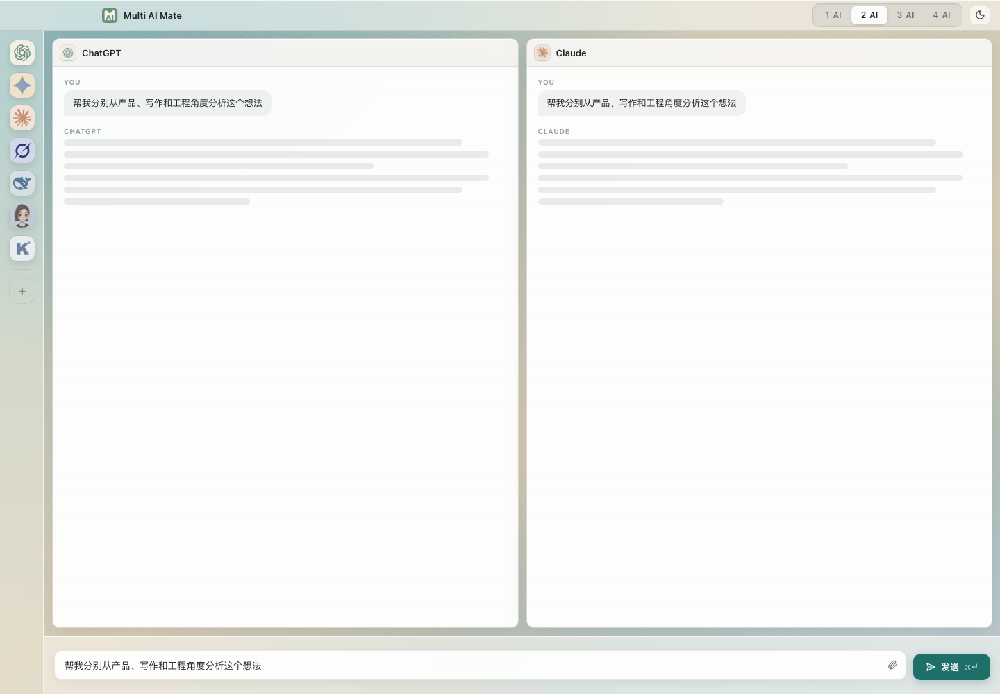

# Multi AI Mate

Multi AI Mate is a macOS-first multi-AI desktop workspace built with React, Vite, and Tauri.

It lets you open multiple AI web apps side by side, drag providers into fixed panel slots, and send one prompt to every open panel in the current mode.



## Features

- 1 AI / 2 AI / 3 AI / 4 AI workspace modes
- Drag AI providers from the left dock into A/B/C/D panels
- Native Tauri child WebViews for real AI web pages
- Persistent workspace state across app restarts
- Custom AI provider support with optional icon upload
- macOS-style glass UI, transparent window, and titlebar integration
- Shared bottom composer with broadcast-send behavior
- Keyboard refresh for all open panels

## Built-In Providers

- ChatGPT
- Claude
- Gemini
- Doubao
- DeepSeek
- Kimi
- Grok
- Custom providers

## Tech Stack

- React 19
- TypeScript
- Vite
- Tauri 2
- Rust
- Vitest
- Lucide React

## Development

Install dependencies:

```bash
npm install
```

Run the web preview:

```bash
npm run dev
```

Run the desktop app:

```bash
npm run dev:desktop
```

Build the frontend:

```bash
npm run build
```

Build the macOS desktop app:

```bash
npm run build:desktop
```

Run tests:

```bash
npm test
```

## Local Test Page

The project includes a local test AI page for verifying WebView message injection without relying on a logged-in AI account:

```text
http://localhost:5173/test-ai.html
```

Add it as a custom AI provider during development, drag it into a panel, and send a message from the composer.

## Notes

The app uses Tauri native child WebViews. Some AI services may require login, region-specific access, or additional per-site selector tuning before automatic message injection can fully work after authentication.
